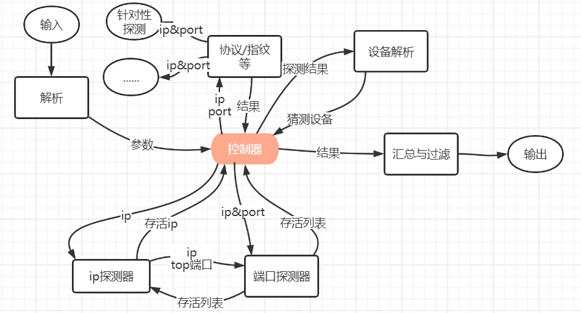

# PiScan
## 简介

对于给定的ip段与port进行扫描, 并对探测得到的端口进行协议、指纹、设备、蜜罐识别, 以json形式输出。

```json
{
  "113.30.191.68": {
    "services": [
      {
        "port": 1022,
        "protocol": "ssh", //协议
        "service_app": ["openssh/7.4"] //指纹
      },
    	...
    ],
    "deviceinfo": null, //设备
    "honeypot": ["2222/kippo"] //蜜罐
  }, 
  "ip": {...}
}
```

## 模块



1. 解析器

   接收输入, 解析为参数并传给控制器

   输入列表(\*为必须):

   - *ip段

   - *结果输出文件名

   - port

     default: top500

   - 不检测ip存活

     直接扫描端口

   - proxy

     只支持socks5

   - threads

     线程数, 默认1000

1. ip探测器

   采用多种技术判断:

   - s
   - icmp包
   - 与端口探测器结合, 当探测到端口开放时判定存活

1. 端口探测器

   采用多种技术判断:

   - syn扫描
   - TCP Null扫描+ACK扫描

   加入cache

1. 协议&指纹

   多种来源联合判断, 同时加入我们的自定义指纹逻辑

   ```python
   Port = int
   Protocal = str
   Service = str, Version
   def api(ip: str, ports: List[Port]) -> List[Tuple[Port, Protocal, List[Service]]]: # 蜜罐将放入Service中
     pass
   
   # 指纹库: Rule(protocal, service, Union[hit_regex, hash], Union[version_regex, version], send_content_id)
   #        Send_content(send_content_id, content)
   ```

1. 设备识别

   根据之前扫描出的结果判断设备

1. 过滤器

   去除不在目标列表中的结果, 汇总为json

